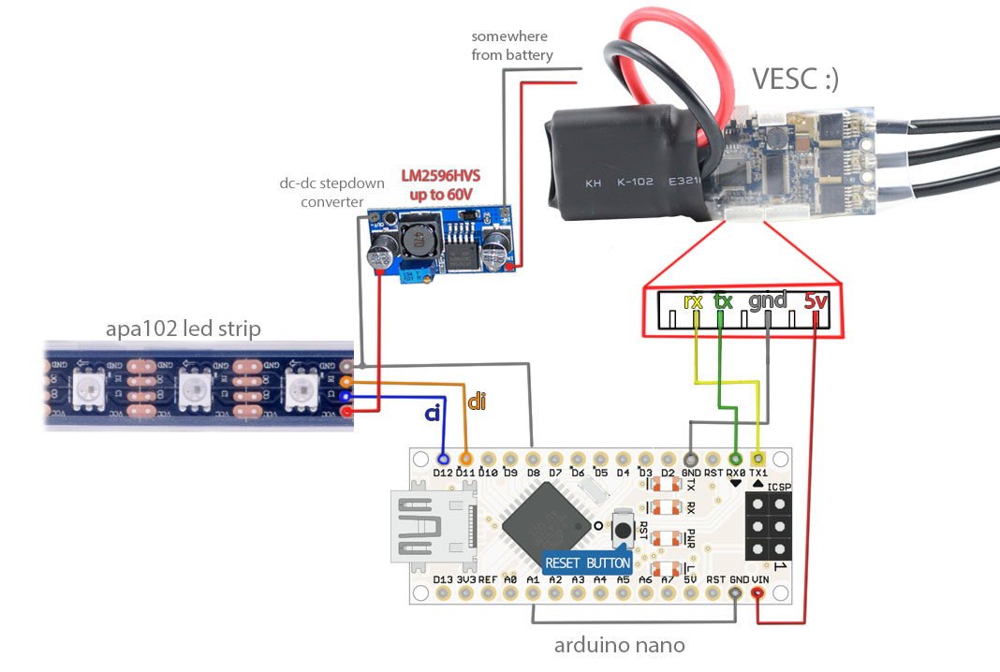

# Synchronized Lighting for VESC

* The idea is to lightup the underbody of a skateboard in accordance with the movement - for example, like you skating the rainbow ;)

* You can choose from existing options and and also create your own lighting color palletes.

* While standby - "breathing lights" mode enabed.

**click to watch video**
[](https://youtu.be/jkwX-VA8xU0)


## This project is easy to repeat - all you need is:

* [Arduino Nano](https://aliexpress.com/item/Nano-V3-ATmega328-CH340G-Micro-USB-Pin-headers-NOT-soldered-Compatible-for-Arduino-Nano-V3-0/32664577152.html) - brains for project

* [APA102](https://aliexpress.com/item/1m-5m-APA102-Smart-LED-Pixel-Strip-30-60-144-LEDs-Pixels-m-IP30-IP65-IP67/32780224340.html) - led strip

* [LM2596HVS](https://aliexpress.com/item/DC-DC-Converter-Adjustable-Power-Supply-DC-DC-Step-Down-3A-LM2596HVS-LM2596HV-DC-Step-Down/32485142548.html) -  DC-DC step down converter

**don't forget to set stepdown converter to +5volts**



## Tuning your VESC Synchronized Lighting

1. Set strip length(led num) and strip brightness(1-31 max) in **"lib/led_strip_apa102/led_strip_apa102.h"** file:
```
#define LED_COUNT 42
#define LED_STRIP_BRIGHTNESS 31
```

2. Tune "WHEEL_SIZE_RATIO" constant in **"main.cpp"** for velocity of color pallete change
```
const uint8_t WHEEL_SIZE_RATIO = 20;
```

3. Also you can tune "STANDBY_TIMEOUT" constant in order to enable standby lighting mode
```
const uint16_t STANDBY_TIMEOUT = 3000;
```

4. Select **"PPM and UART"** in **"APP setting"** of **"VESC tool"**.

5. You are ready to go!

6. You can create your own color palletes and set it up in **"lib/color_palletes/color_palletes.h"** file.
<br/>
**CURRENT_PALLETE_WIDTH** must be equal to pallete elements, for example, if you want to create new pallete with 3 elements:
```
const hsv_color pallete_name[3] PROGMEM = { 0, 240, 0 };
```
or
```
const hsv_color another_pallete_name[6] PROGMEM = { 0, 240, 0, 240, 0, 240, };
```
so **CURRENT_PALLETE_WIDTH** must be equal to number in **[ ]** brackets and count of values in **{ }** brackets.


## To compile this project in Arduino IDE:

1. Create new folder for this project. For example name it **synchronized_lighting**.

2. Copy main.cpp to this folder.

3. Rename **main.cpp** to **synchronized_lighting.ino**

4. Copy all files from **lib** folder and subfolders to your newly created directory **synchronized_lighting** folder.

5. Open Arduino IDE and install **FastGPIO** and **APA102** libraries.

6. Compile!

7. **Power down or even disconnect your VESC from Arduino when uploading new firmware.**


### If you use this project and like it - Please Donate

[](https://www.paypal.com/cgi-bin/webscr?cmd=_s-xclick&hosted_button_id=LHTUV26X68QS6)
